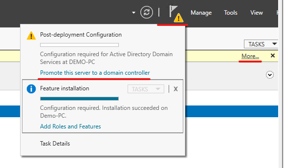
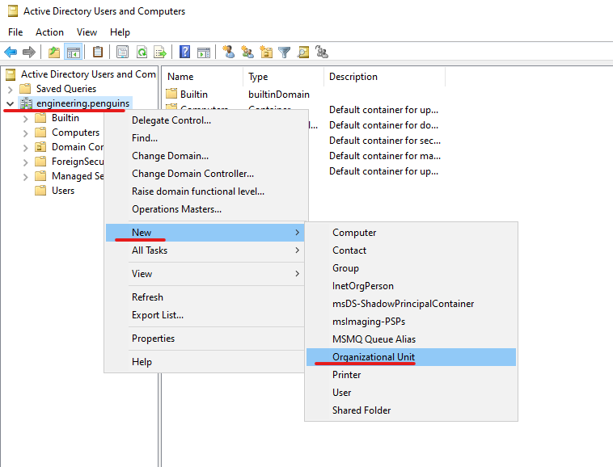
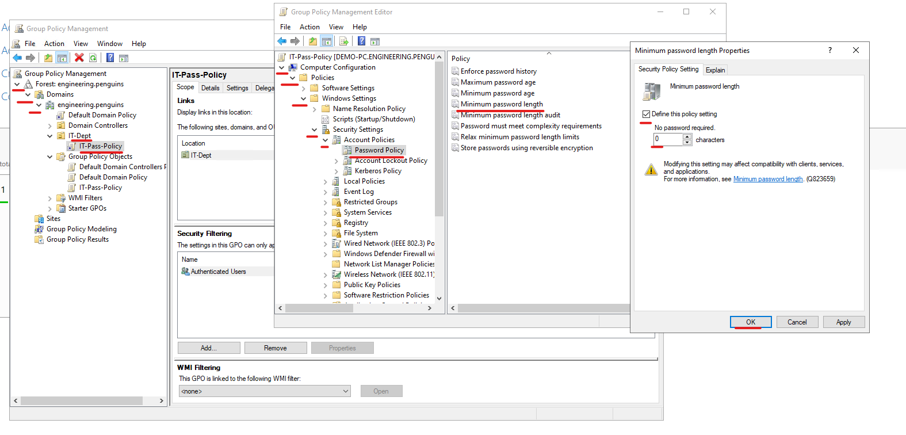
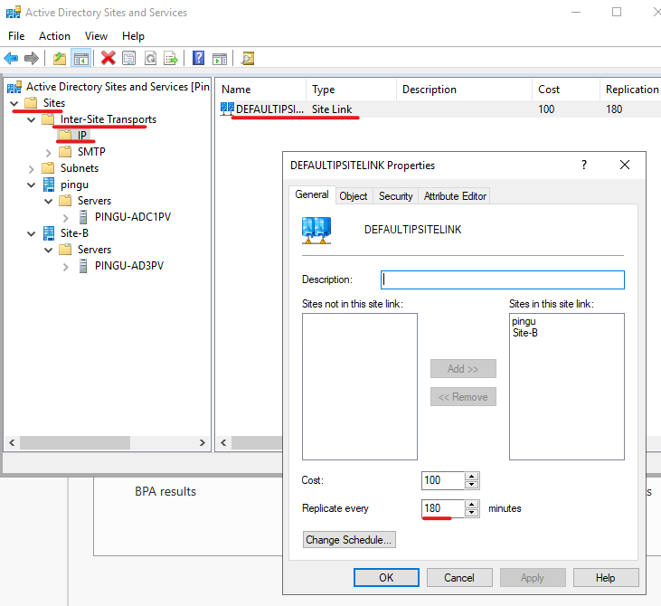
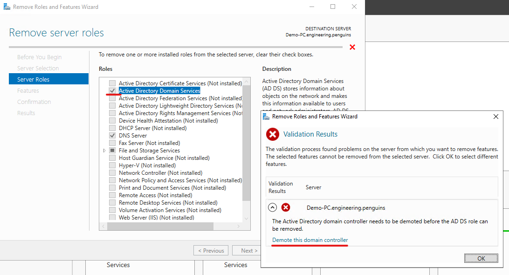

# Active Directory Domain Services

## Introduction

Windows **Active Directory** (AD) is Microsoft's solution to the problem of identity management. At the enterprise level, solutions like AD are essential for scalable **Role Based Access Control (RBAC)** to company resources. Due to Microsofts ecosystem extending into many popular web applications, AD allowes users to integrate with a variety of services integral to an employees workflow. While Active Directory is still the most widely used **Identity Access Management** (IAM) it is confined to run on-premises, meaning that cloud native solutions like **Azure Active Directory** (AAD) will slowly become the new standard (likely making this article irrelevant in a few years).  

### Table of Contents

<ol>
  <li><a href="#installing-adds"> ADDS</a></li>
  <li><a href="#active-directory-users-and-computers"> ADUC</a></li>
  <li><a href="#group-policy-management"> GPO</a></li>
  <li><a href="#active-directory-sites-and-services"> ADSS</a></li>
  <li><a href="#appendix"> Appendix</a></li>
</ol>

 

## Overview of Active Directory & Domain Services

AD is actually a suite of services that run on a **Domain Controller** (DC), which is just a Windows server (resist the urge to force it to work on Linux) with an appropriate **server role** attached. Typically when people refer to doing any kind of administration or operations in AD they are actually refering to **Active Directory Domain Services** (ADDS) which is responsible for the most used common functions like **Active Directory Users and Computers** (ADUC) and **Group Policy Management Console** (GPMC). ADDS essentially allows the domain to exist by installing all of the dependencies and foundation required for an AD environment.  

When starting out in IT it was confusing how a FQDN (Fully Qualified Domain Name) was refered to as a domain and Windows also referes to the AD enviornment as a domain. If faced with that question now I would say that a windows domain name is technically the same as a FQDN. For example: 'mail.example.com' looks like a FQDN because we recognize the format (subdomain.domain.tld) but 'mail.domain.local' is the same thing from a DNS perspective. You can have **subdomains** (sometimes called **child domains**) that are divisions of a **root domain** (ex. mail.example.local where mail is the subdomain). A root domain and all of its subdomains are considered a **tree**. A **forest** can comprise of a single tree or multiple trees clustered together (ex. sample.local and domain.local are two trees). The "TLD" (not technically a tld - not ICANN registered) of a windows **domain suffix** can be anything you want, provided it fits within the accepted characters and length limits.  

Windows domains are just containers/folders that store and organize data objects. Just like the file browser on your OS you can apply policy, permissions, automations, and other operations to the data inside a 'folder'. Types of data you might find in AD are: user profiles & configurations, inter-domain relationships, computer/server policies & configurations, authentication, file sync and backups, centralized deployment, and maintenance/administration. Ideally you have a DC local to any site that users are authenticating to, not only for faster logins but also to prevent every user from creating sessions to a single DC. When you have multiple DCs in the same domain, they will all establish a **replication** topology that allows a **record** change (ex. updating a password or email) on one DC to be replicated to all other DCs. 

The most important things to know about replication are that replication errors range from a users password not updating on other DCs (causing intermitent login issues) to records becoming corrupted or lost (causing potentially devastating operational impact). The risk of a severe loss of data or corruption is minimal as a DC will use a function weighing the last modified time and the **version number** (relative sequence ID of how many times the attribute has been modified) of an **attribute** to determine what data is the 'most correct'. One of the most common causes of replication errors is a DC that cannot check in with other DCs in the same domain for a set amount of time. Even if the out of sync DC is able to start communicating again, the other DCs will reject any communication from it. This can happen to **domain members** (like PC/workstations) as well. Lesson: never power off a DC or member workstation for an extended period of time or it will become permanently out of sync.  

### Installing ADDS

Fortunately installing ADDS is a cake walk but remember: the MOMENT you introduce more than 1 DC in a domain, you have made your AD enviornment 1000% more complex. That isnt to discourage distributed DC deployments, but it is essential to wisely use DCs where they are needed and to maintain a healthy replication topology. Note that a DC does not have ANY local accounts on it so any local users/profiles will be destroyed, you can only sign in to a DC with a domain account.  

Only a Windows server can be **promoted** to a DC, this article assumes you have setup a windows server with some basic configuration. Refer to [Windows Setup Guide](Windows-Setup.md) for a rundown on how to do basic server administration. You can bypass some of these requirements but don't be that guy. This article used Windows Server 2022 for screenshots and interface verbiage but anything past 2012 is going to be fairly consistent.  

Removal can be a bit more tricky, refer to [Demoting a DC](AD-DomSvc.md#demoting-a-dc) for more info.  

##### Pre-Reqs

1. Static ip address set on the server
2. The server shouldnt be ANYTHING other than a domain controller
   - Do not use a DC for other purposes like WSUS, WDS, ADCS, etc. or any kind of app/web/file server
3. You will need admin access on the server to access the Server Manager and configure the domain
4. The 'Active Directory Domain Services' role should be enabled 
   - To add a role, refer to [Windows Setup Guide](Windows-Setup.md)

##### Additional Pre-Reqs - If adding to an existing domain

1. Upstream DNS should be pointed at an existing DC
2. Server should be a member of the domain
3. You will need admin access to promote a server to a DC
4. The servers hostname should be unique across the domain (ideally never been used historically either)

### Promoting a DC

1. Open the Windows Server Manager
2. Select the yellow flag in the upper right
3. Click 'Promote this server to a domain controller'
   - 
4. Choose what you want to do with this DC
   - Add a DC to a domain, add a domain to a forest, or make a new forest
   - I chose to make a new forest for this, but steps are nearly identical for all options
5. Provide the root domain name and click 'Next'
   - You dont want to use a public dns suffix but can use anything you want (.local is the most common)
   - For this example I used 'engineering.penguins'
6. Set the Forest functional level to the lowest common denominator of your server edition
   - If you have any Server 2012's DCs in your domain you want to set it to 2012
   - If everything is or is going to be the latest server OS then just set this to the most recent option
7. Check the boxes to make the DC a DNS server and a **Global Catalog (GC)**
   - Global Catalog just indicates 'how much' the DC knows about the forest
   - A non GC might only know about its sub-domain but a GC knows about every object in every domain
8. Provide a password for use with the local DSRM and click 'Next'
   - DSRM allows you to basically boot the server into safe mode and edit AD
9. If you can set a DNS delegation do so here but as I am setting up a new domain its not an option
10. On the following screen, set the NetBIOS name for the domain and click 'Next'
    - This is typically just the root domain without the suffix
    - Shorter is faster for manual authentication so instead of 'Engineering' I set mine to 'ENG'
11. Set the local paths for AD databases and files and click 'Next'
    - I always use the default locations on the C: drive but for security or storage reasons you can change
12. Verify the settings and click 'Next'
13. Click 'Install' to initialize the DC
    - A new forest install is FAST but adding to an existing domain can take a while
    - The server will automatically restart after installation

If this is a new forest the local 'Administrator' account will be promoted to the first **domain admin** account. So you will have to use 'Administrator@domain.example' (Administrator@engineering.penguins for this demo) to login the first time.  

    <a href="#introduction" style="text-decoration: none; color: #007bff; font-weight: bold;">
        ↑ Back to Top ↑
    </a>

 

---

## Functions of Active Directory Domain Services

Now that you have a functioning DC several functions/applications are now available for management and configuration of the domain on this server. If this was the first DC in the domain note that the domain is fully functional without additional configuration, but it is more painful to set things up correctly after something is already in production. The lesser used tools are not covered in this article but are still useful in the right circumstances.  

##### Examples of omitted content

- Active Directory Administrative Center (ADAC)
  - Microsofts failed attempt at a ADUC GPO hybrid
  - Offers niche features and QoL features but goes mostly unused
- Active Directory Domains and Trusts (ADDT)
  - Certainly useful in a multi domain forest but is mainly used in security contexts
  - Control visability and cross domain relationships

### Active Directory Users and Computers

Active Directory Users and Computers (ADUC) is the primary tool that ADDS and AD in general is used for. ADUC at a high level is just an excel sheet of people and machines that have been created/joined to the domain. What makes AD/ADUC so powerful is the (seemingly) simple operation and interactions. With a (subjectively) aesthetic graphical experience with the most used features being only a few clicks away, ADUC brings a lot of management capability to people without a lot of technical background. Typically entry level helpdesk jobs are focusing on things in ADUC (password resets, locked accounts, email updates, permissions). A more technical role like a sysadmin is able to use advanced features in ADUC to identify seemingly inexplicable issues or set complex user/computer configurations.  

Everything in ADUC exists in a hierarchy similar to the tree view of a filesystem (its very similar to windows explorer). The 'root folder' of the filesystem is the domain itself which contains all of the sub folders (I am keeping with the file system metaphor but note that none of the content in aduc is actually a folder or file). By default there is less than a handful of subfolders that provide basic organization. In an enterprise AD enviornment there should be significantly more than the default due to the need for specific policy application and scalable object organization. There are a few types of the 'sub folders' that are provide unique use cases, with the exception of 'Domain Controllers' **Organizational Unit** all of the default content is a **Container**. In the context of ADUC, a container is folder that stores other object but is not identified as something that policy can be applied to. An organizational unit (OU) is a container that can be targeted by policies and more advanced use cases. Custom containers are rare in my experience as you normally just make an OU for more granular control. If you wanted to seperate users by job function to provide different levels of access you could use OUs and **Group Policy Objects** (GPO) which is covered in [Group Policy](ad-domsvc.md#group-policy-management). To avoid complex nested folders and policies you could also use **Security Groups** to provide different access for users by job function.  

#### Example of using ADUC

Lets create an OU for the IT dept. and make a demo user in the group with a custom group membership.

1. Login to a domain controller
2. Open the Windows Server Manager
3. Select 'Tools' in the upper right and click 'Active Directory Users and Computers'
4. Click the dropdown for your domain and note that the icon for 'Domain Controllers' looks different due to it being an OU and not a container
5. Right click on the domain
6. Hover over the 'New' menu item and click 'Organizational Unit'
   - 
7. Name it 'IT-Dept' and click 'OK'
8. Right click on the 'IT-Dept' OU in the navigation pane on the left
9.  Hover over the 'New' menu item and click 'User'
10. Provide a First/Last name and a username for the domain before clicking 'Next'
11. Set the Users password and click 'Next'
    - You can check boxes to disable the account if you are pre provisioning someone or force them to change their password on first sign-in (reccomended)
12. Click 'Finish' and note the user is in the IT-Dept. OU
13. Right click on the 'IT-Dept' OU
14. Hover over the 'New' menu item and click 'Group'
15. Name it 'IT-Group' and click 'OK'
    - The default radio buttons set to 'global' and 'security' are fine
    - Note that this group lives in the 'IT-Dept' OU but some orgs prefer all of the groups to be in the same OU
16. Double click on the 'Test User' and click the 'Member of' tab in the properties window
17. Click 'Add' to open the group membership search
18. Type 'IT' and click 'Check Names' to autofill the IT-Group
    - This only works because 'IT ...' is unique in our domain
19. Click 'OK' on the dialogue box and 'OK' again on the user properties window

    <a href="#introduction" style="text-decoration: none; color: #007bff; font-weight: bold;">
        ↑ Back to Top ↑
    </a>

 

---

### Group Policy Management

Group Policy is the system that administrators use to deploy configurations to an AD domain. A **Group Policy Object** is a collection of configured settings for a defined AD entity (Users, Groups, Computers, Sites, etc.), you can have a GPO with a single setting in it but typically I have GPOs built to do a specific purpose with a collection of settings (ex. set a password policy that enforces a complexity and length requirement and locks the users account after repeated failures). Once you have a GPO you can then **link** it to an OU or site within a domain, in the instance of sub domains you can link root domain GPOs to any subdomain but subdomains cannot link between each other. Most common GPOs are simple (like my password example) but you can escalate very quickly and have multi staged policies with dependencies on other policies. The real complexity of GPO in my experience is not difficult policy configuration, but policy interaction and **inheritence**. A policy conflict is resolved with a preference for the nearest policy to the object being affected (ex. a setting at the domain level will be superceeded by a policy linked at the OU level), but there are mechanisms in place to block or force the application of policies to objects with additional **security filtering** and **delegation** being possible on top of that. Ideally you can set things up to be as simple as possible with as little reliance on policy overlap/conflict as possible. The big picture is that a GPO set at the top 'folder' will waterfall down (called policy inheritence) to all 'sub folders' (going back to my metaphor in [ADUC](AD-DomSvc.md#active-directory-users-and-computers)). Instead of having a ton of GPO's linked to specific OUs to avoid overlapping policies, or blocking/enforcing inheritence per OU, I prefer to be specific in how the policy itself is being applied. You can use Security Filtering to tag a specific security group and limit the policy to that group, doing this lets you set more policies at the top of the tree and selectively apply it to matches below.  

#### Example of using Group Policy

Now lets create a single configuration password security policy GPO and apply it to the OU

1. Login to a domain controller
2. Open the Windows Server Manager
3. Select 'Tools' in the upper right and click 'Group Policy Management'
4. Click the dropdowns for:
   1. the Forest
   2. then for 'Domains'
   3. then your root domain (engineering.penguins for me)
5. Right click on the 'IT-Dept' OU and select 'Create a GPO in this domain and link it here'
6. Name it 'IT-Pass-Policy' and click 'OK'
7. Right click on the 'IT-Pass-Policy' GPO and select 'Edit'
8. Click the dropdowns for:
   1. 'Computer Configuration'
   2. 'Policies'
   3. 'Windows Settings'
   4. 'Security Settings'
9. Left click 'Password Policy'
10. Double click 'Minimum password length' in the Policy table on the right
11. Check the box for 'define this setting' and set the value to 8 before clicking 'OK'
    - 
12. Close the management editor (tree view of different policy options)
13. Remove the 'Authenticated Users' group in the 'Security Filtering' section of the GPO
14. Accept the disclaimer about removing this group
15. Type 'IT' and click 'Check Names' to autocomplete the 'IT-Group' entry before clicking 'OK'

    <a href="#introduction" style="text-decoration: none; color: #007bff; font-weight: bold;">
        ↑ Back to Top ↑
    </a>

 

---

### Active Directory Sites and Services

In an enviornment with multiple locations and DCs you can manage the replication topology with Active Directory Sites and Services (ADSS), this is especially useful if you have multiple domains/subdomains in a forest. The main feature of ADSS is building 'sites' which are basically just OUs (this is a reference, they are NOT OUs) that contain DCs. The sites can be seperate buildings, networks, states, countries, etc. and its really just a way to trim down excess replication activity. A classic setup for a small business might be having a 'master' site that houses your FSMO master DCs, a 'main' site for the head office, and a 'branch' site for a smaller remote site. You could have the main and branch sites not replicate with each other for efficiency and just replicate with the master site. When using subdomains or multiple domains in a forest ADDS helps you silo the different domains and keep things clean for use with GPO. If you have unique subnets for each site you can assign those networks to a site and any DC with an ip on that network will automatically be a member of that site. To change the replication intervals or set relationships between sites you would use **Intersite Transports** which are just links with a list of sites that are members of the intersite transport.  

#### Example of using Active Directory Sites and Services

We will create a site for an example branch office and decrease replication time

1. Login to a domain controller
2. Open the Windows Server Manager
3. Select 'Tools' in the upper right and click 'Active Directory Sites and Services'
4. Right click on 'Sites' and click 'New Site'
5. Name it 'SiteB' and left click the 'DEFAULTIPSITELINK' before clicking 'OK'
6. Click the dropdown for the default site and the dropdown for the servers in the site
7. Right click on a DC and select 'Move' and select 'SiteB' before clicking OK
8. Click the dropdown for 'Intersite Transports' and left click 'IP'
9. Double click on 'DEFAULTIPSITELINK' to open the configuration
10. Change the replication interval to 120 and click OK
    - 

    <a href="#introduction" style="text-decoration: none; color: #007bff; font-weight: bold;">
        ↑ Back to Top ↑
    </a>

 

---

## Appendix

### Demoting a DC

Your ideal scenario for demoting a DC is if you can still access the server itself and the domain controller is still in the replication topology. If you are so lucky to have at least access to the server itself there is a sliver of hope that things will go smoothly. If you do not have access to the server anymore we will need to clean up more mess.  

#### Demoting a DC that you have access to

##### Notes

- If you have to hit it with a hammer and leave a mess in the domain (have metadata) you may need to use ADSI Edit or NTDSUTIL to clean it up
  - You likely will not have to use these tools but I like to be safe and confirm things are gone
- If this is the last/only DC in the domain the process differs *slightly* but it is more intuitive
- Anything using this DC will break (ex. authentication, dns, ntp, file access)
  - Forgetting this is a GREAT way to brick your vCenter/ESXI management :)
- The process relies on the server telling the domain about the removal of the DC
  - The DC doesnt need to be in the replication topology for this communication but it does need network access to the domain
- There is a real possibility of the demotion operation failing, retry it a few times before hitting it with a hammer
- You cannot specifiy the server that your DC will try and communicate the demotion with
  - If the DC that it chooses is inaccessible you are hosed, even changing replication partners on your DC has no affect, so hammer is needed
- FSMO roles will be transfered automatically (random target) during demotion but you should really manually set these on your new master DC

##### Process

1. Open the Windows Server Manager
2. Select 'Manage' in the upper right and click 'Remove Roles and Features'
3. Click 'Next' twice to arrive at the installed roles screen
4. Uncheck the box for 'Active Directory Domain Services'
5. Click 'Remove Features' on the dialogue box that appears
6. Click 'Demote this Domain Controller' on the next dialogue box
   - 
7. Leave 'Force Removal' UNCHECKED and click 'Next'
   - Force Removal will destroy any unreplicated data (if any) causing data loss 
   - It will also leave metadata all over the place
8. Check the box for 'Proceed with Removal' and click 'Next'
9.  Check the box to 'Remove DNS Delegation' if any and click 'Next'
10. Provide a new Administrator password and click 'Next'
    - This will become the 'Administrator' local PC user
11. Click 'Demote' to begin the process
    - If the demotion is successful the server will restart

##### Cleanup With ADSS

1. Login to another DC in the domain
2. Open the Windows Server Manager
3. Select 'Tools' in the upper right and click 'Active Directory Sites and Services'
4. Locate the DC you removed in the hierarchy
5. Right click on the DC and select 'Delete'
6. Click 'Yes' on the confirmation dialogue prompt
7. Confirm deletion if you get another dialogue prompt
   - RODC and DC's without the GC flag will not initiate this second prompt

##### Cleanup with NTDSUTIL

1. Login to an active DC in the domain
2. Open an admin powershell session
3. Run the following commands
   1. `ntdsutil`
   2. `metadata cleanup`
   3. `connections`
   4. `connect to server localhost`
   5. `quit`
   6. `select operation target`
   7. `list domains`
   8. `select domain 0`
      - or another domain in the list if you have multiple
   9. `list sites`
   10. `select site 0`
      - or whatever site housed the DC you demoted
   11. `list servers in site`
       - Your demoted server should not exist here, if it does continue with the cleanup
   12. `select server 0`
       - or whatever the ID of your server in the list was
   13. `quit`
   14. `remove selected server`
   15. `quit`

NTDSUTIL should not have picked anything up, if you did have to remove metadata then something broke. Worth further investigation with Event Viewer, ADSI edit, and NTDSUTIL.  

#### Demoting a DC that you do not have access to

##### Notes

- Microsoft and every sysadmin will insist on demoting DCs using the server manager [if possible](AD-Domsvc.md#demoting-a-dc-that-you-have-access-to) despite the time savings doing it this way
  - I suspect there is additional metadata or connection strings burried in the AD database that are not taken care of unless using the server manager
- Its a good idea check your replication health after this process to avoid any inconsistencies on the agreed replication topology

##### Process

1. Login to an active DC in the domain
2. Open Windows Server Manager
3. Select 'Tools' in the upper right and click 'Active Directory Users and Computers'
4. Select the appropriate domain and open the 'Domain Controllers' OU
5. Right click on the DC to demote and select 'Delete'
6. Check the box to confirm the DC is permenantly offline and click 'Delete'
7. Repeat the steps provided above for [Cleanup with ADSS](AD-DomSvc.md#Cleanup-with-ADSS) and [Cleanup with NTDSUTIL](AD-DomSvc.md#Cleanup-with-NTDSUTIL)

    <a href="#introduction" style="text-decoration: none; color: #007bff; font-weight: bold;">
        ↑ Back to Top ↑
    </a>

 

---
